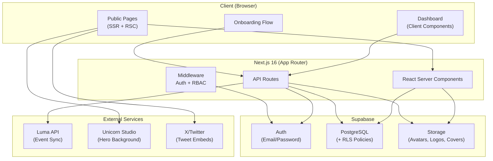
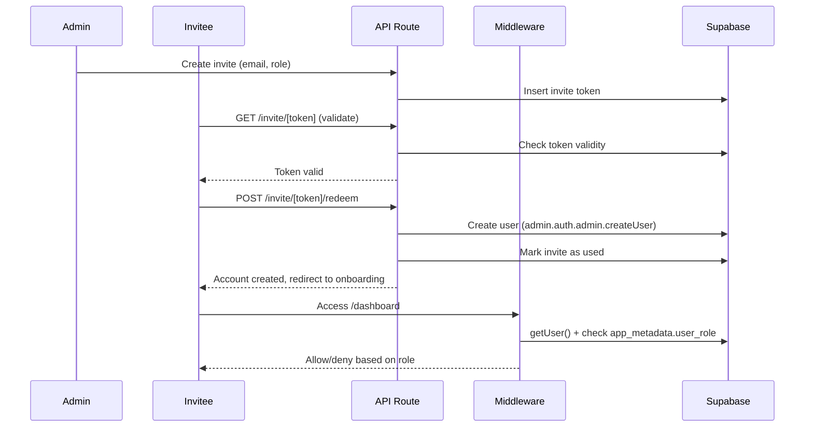

# Superteam Malaysia

> The digital headquarters for Solana builders in Malaysia — built with Next.js 16, Supabase, and modern web animations.

**Live:** [superteammy-three.vercel.app](https://superteammy-three.vercel.app/)

---

## Table of Contents

- [Project Overview](#project-overview)
- [Design Rationale](#design-rationale)
- [Architecture](#architecture)
- [Tech Stack](#tech-stack)
- [Features](#features)
- [Project Structure](#project-structure)
- [Getting Started](#getting-started)
- [Environment Variables](#environment-variables)
- [Database Setup](#database-setup)
- [Local Development](#local-development)
- [Deployment](#deployment)
- [Security Model](#security-model)
- [API Reference](#api-reference)
- [Design System](#design-system)
- [Contributing](#contributing)
- [Acknowledgments](#acknowledgments)

---

## Project Overview

Superteam Malaysia is the local chapter of the [Superteam](https://superteam.fun) global network — a community of builders, creators, and founders in the Solana ecosystem. This website serves as the community's digital hub, providing:

- A **public-facing landing page** with animated visuals, community stats, event listings, member spotlights, and testimonials
- A **members directory** with skill-based search, filterable flip-style profile cards, and badge indicators
- A **member dashboard** for profile management, project showcasing, and claiming community perks
- An **admin dashboard** with full CMS capabilities — managing members, events, partners, perks, invites, and site content
- An **invite-only onboarding flow** for controlled community growth via tokenized invites

The platform is designed to be fully self-managed by the community — no external CMS is required. All content, events, and member data are managed through the admin dashboard, backed by Supabase.

---

## Design Rationale

### Visual Identity — The Portal Concept

Superteam Malaysia functions as a **talent layer** — a bridge that connects local Malaysian talent to global experts, opportunities, and exposure within the Solana ecosystem. The entire visual identity is built around the metaphor of a **portal**: a gateway from the local scene into the broader Web3 world.

This is reflected throughout the design:

- **Dark background (`#080B0E`) with gradient accents** — The deep space-like canvas represents the vastness of the global ecosystem, while Solana's signature purple (`#9945FF`) and green (`#14F195`) gradients evoke the energy of passing through a portal — futuristic, electric, and alive.
- **Unicorn Studio animated background** — The hero section features an animated portal-like visual that reinforces the gateway concept. The swirling, luminous gradients draw the user in, symbolizing the transition from local to global.
- **Gradient and glow effects** — Used consistently across CTAs, cards, and section transitions to maintain the futuristic, portal-inspired atmosphere throughout the site.

### Malaysian Identity

While the theme is futuristic and globally oriented, the design intentionally roots itself in Malaysia through cultural and architectural references:

- **KLCC (Petronas Twin Towers)** — Featured as a recognizable Malaysian landmark, grounding the portal concept in a specific place. The towers themselves are a symbol of Malaysian ambition on the world stage.
- **Malaysia Map** — Used as a visual element to establish geographic identity and reinforce that this is the Malaysian chapter of a global network.
- **Daftaran Merdeka** — A nod to Malaysia's independence and self-determination, tying the community's mission of empowering local builders to the broader national spirit of building something of your own.

These Malaysian elements create a sense of pride and belonging, ensuring the site feels distinctly local even as it connects members to a global ecosystem.

### Typography

- **Orbitron** — Used for display headings and hero text. Its geometric, futuristic letterforms reinforce the portal/tech-forward identity.
- **Archivo** — Used for body text and UI elements. Its clean, highly legible design ensures readability across long-form content and smaller interface elements.

---

## Architecture

### System Architecture



### Authentication & Authorization Flow



### Role-Based Access Control

```
super_admin ──► All dashboard routes (members, invites, events, partners, content, perks, metrics)
admin ────────► Events, partners, content, perks management
member ───────► Profile, projects, perks (claim only)
public ───────► Landing page, members directory
```

---

## Tech Stack

| Layer | Technology | Purpose |
|-------|------------|---------|
| **Framework** | Next.js 16.1.6 | App Router, RSC, API routes, middleware |
| **UI Library** | React 19 | Server & client components |
| **Language** | TypeScript 5 | End-to-end type safety |
| **Styling** | Tailwind CSS v4 | Utility-first CSS with PostCSS |
| **Components** | shadcn/ui (Radix) | Accessible primitives (Dialog, Accordion, Dropdown, etc.) |
| **Animation** | GSAP + Framer Motion | Scroll-triggered and component animations |
| **Smooth Scroll** | Lenis | Cross-browser smooth scrolling |
| **Database** | Supabase (PostgreSQL) | Relational data with RLS policies |
| **Auth** | Supabase Auth | Email/password, JWT, role-based access |
| **Storage** | Supabase Storage | Avatars, partner logos, event covers, perk icons |
| **Events** | Luma API | Event sync and ICS feed |
| **Charts** | Recharts | Dashboard analytics visualizations |
| **Forms** | react-hook-form + Zod | Validated forms with schema-based validation |
| **Icons** | Lucide React | Consistent icon system |
| **SEO** | next-sitemap | Sitemap and robots.txt generation |
| **Drag & Drop** | @dnd-kit | Sortable lists in admin |
| **Tweets** | react-tweet | Static tweet embeds for Wall of Love |
| **Image Crop** | react-image-crop | Avatar cropping during onboarding |
| **Date Utils** | date-fns | Date formatting and manipulation |

---

## Features

### Public Site

| Feature | Description |
|---------|-------------|
| **Hero** | Animated Unicorn Studio background, scramble-text navigation, gradient headline with CTAs |
| **Who We Are** | Scroll-reveal text block with Malaysia-specific context |
| **Mission** | Four pillars — Learn, Build, Grow, Earn — with illustrative imagery |
| **Stats** | Animated counters for community metrics |
| **Events** | Upcoming and past events synced from Luma with ICS support |
| **Members Spotlight** | Marquee-style featured member cards |
| **Partners** | Logo grid of ecosystem partners |
| **Wall of Love** | Embedded tweets from community members |
| **FAQ** | Accordion-style frequently asked questions |

### Members Directory (`/members`)

- Full-text search by name, role, and company
- Multi-select skill-based filtering
- Flip-style cards with badge indicators (Bounty Hunter, Solana Builder, Hackathon Winner, Core Contributor)
- Expandable profile overlay with social links

### Member Dashboard (`/dashboard`)

- **Overview** — Quick stats and navigation
- **Profile** — Edit personal details, avatar upload with crop, skills, social links
- **Projects** — Showcase proof-of-work with descriptions and skill tags
- **Perks** — Browse and claim community benefits

### Admin Dashboard

- **Members** — View, search, edit, and manage all member profiles _(super_admin only)_
- **Events** — CRUD operations, Luma sync, archive management
- **Partners** — Logo upload with crop, ordering via drag-and-drop
- **Community** — Manage Wall of Love tweet embeds
- **Perks** — Create and manage member perks
- **Site Content** — Edit landing page copy and stats
- **Metrics** — Dashboard analytics with charts
- **Invites** — Generate, track, and manage invite tokens _(super_admin only)_

### Invite & Onboarding

- Token-based, single-use invite links with expiry
- 5-step guided onboarding: Basic Info → Professional → Skills → Social Links → About You
- Avatar upload with interactive crop

---

## Project Structure

```
superteammy/
├── public/
│   ├── images/                    # Landing page images
│   ├── icons/                     # Social media icons
│   └── videos/                    # Loading screen videos
├── scripts/
│   ├── bootstrap-super-admin.ts   # Create first super admin
│   ├── seed.ts                    # Seed landing page data
│   ├── seed-dashboard.ts          # Seed dashboard data
│   └── optimize-loading-video.sh  # Compress loading video
├── src/
│   ├── app/
│   │   ├── (site)/                # Public site (Navbar + Footer layout)
│   │   │   ├── page.tsx           # Landing page
│   │   │   └── members/           # Members directory
│   │   ├── dashboard/             # Protected dashboard routes
│   │   │   ├── page.tsx           # Overview
│   │   │   ├── profile/           # Member profile
│   │   │   ├── projects/          # Proof of work
│   │   │   ├── perks/             # Claim perks
│   │   │   ├── members/           # Admin: member management
│   │   │   ├── events/            # Admin: event management
│   │   │   ├── partners/          # Admin: partner management
│   │   │   ├── community/         # Admin: community tweets
│   │   │   ├── manage-perks/      # Admin: perk management
│   │   │   ├── content/           # Admin: site content
│   │   │   ├── metrics/           # Admin: analytics
│   │   │   └── invites/           # Admin: invite management
│   │   ├── admin/                 # Admin client components
│   │   ├── onboarding/            # 5-step onboarding flow
│   │   ├── invite/[token]/        # Invite redemption
│   │   └── api/                   # API routes
│   ├── components/
│   │   ├── layout/                # Navbar, Footer, AppShell
│   │   ├── landing/               # All landing page sections
│   │   ├── members/               # Member cards, filters, profiles
│   │   ├── admin/                 # Admin-specific components
│   │   ├── dashboard/             # Dashboard charts
│   │   ├── onboarding/            # Onboarding components
│   │   └── ui/                    # shadcn/ui + custom primitives
│   ├── contexts/                  # Loading, Lenis, HeroLogoRef
│   ├── hooks/                     # useScrambleText
│   ├── lib/
│   │   ├── supabase/              # Client, server, admin, queries
│   │   ├── types.ts               # Shared TypeScript types
│   │   ├── data.ts                # Seed/sample data
│   │   ├── luma.ts                # Luma API client
│   │   ├── luma-ics.ts            # Luma ICS feed parser
│   │   ├── luma-sync.ts           # Luma event sync logic
│   │   └── utils.ts               # General utilities
│   └── middleware.ts              # Auth + RBAC middleware
├── supabase/
│   ├── schema.sql                 # Base database schema
│   └── migrations/                # 15+ incremental migrations
├── .env.example                   # Environment variable template
├── next.config.ts                 # Next.js configuration
├── next-sitemap.config.js         # SEO sitemap config
├── components.json                # shadcn/ui configuration
├── tsconfig.json                  # TypeScript configuration
└── package.json
```

---

## Getting Started

### Prerequisites

- **Node.js** 18+ (recommended: 20.x or later)
- **pnpm** (or npm/yarn)
- **Supabase account** — [supabase.com](https://supabase.com)
- **Luma API key** _(optional, for event sync)_

### Installation

```bash
# Clone the repository
git clone https://github.com/user/superteammy.git
cd superteammy

# Install dependencies
pnpm install

# Copy environment template
cp .env.example .env.local
```

---

## Environment Variables

Create a `.env.local` file from the provided template:

| Variable | Required | Description |
|----------|----------|-------------|
| `NEXT_PUBLIC_SUPABASE_URL` | Yes | Your Supabase project URL (e.g. `https://abc123.supabase.co`) |
| `NEXT_PUBLIC_SUPABASE_PUBLISHABLE_DEFAULT_KEY` | Yes | Supabase anon/publishable key for client-side access |
| `SUPABASE_SERVICE_ROLE_KEY` | Yes | Supabase service role key for server-side admin operations (invite redemption, user creation) |
| `NEXT_PUBLIC_SITE_URL` | Yes | Public URL of the site (`http://localhost:3000` for development) |

```env
# Supabase (required)
NEXT_PUBLIC_SUPABASE_URL=https://your-project.supabase.co
NEXT_PUBLIC_SUPABASE_PUBLISHABLE_DEFAULT_KEY=sb_publishable_your-key-here
SUPABASE_SERVICE_ROLE_KEY=your-service-role-key


# Site URL
NEXT_PUBLIC_SITE_URL=http://localhost:3000
```

> **Important:** Never commit `.env.local` to version control. The `.env.example` file is provided as a safe template.

---

## Database Setup

### 1. Create a Supabase Project

1. Go to [supabase.com/dashboard](https://supabase.com/dashboard)
2. Create a new project and note your **Project Reference ID** (Settings → General)
3. Copy the API URL, anon key, and service role key to `.env.local`

### 2. Apply Database Migrations

**Option A: Supabase CLI (recommended)**

```bash
# Login to Supabase
npx supabase login

# Link to your project
npx supabase link --project-ref YOUR_PROJECT_REF

# Push all migrations
npx supabase db push
```

**Option B: Manual SQL**

1. Run `supabase/schema.sql` in the Supabase SQL Editor for the base schema
2. Run each file in `supabase/migrations/` in timestamp order

### 3. Create Storage Buckets

The migrations create the following storage buckets automatically. Verify they exist in Supabase Dashboard → Storage:

| Bucket | Purpose |
|--------|---------|
| `avatars` | Member profile photos |
| `partner-logos` | Partner company logos |
| `event-covers` | Event cover images |
| `perk-icons` | Perk benefit icons |
| `landing-images` | Landing page images |

### 4. Bootstrap the First Super Admin

```bash
npx tsx scripts/bootstrap-super-admin.ts
```

This creates the first `super_admin` user who can then invite other members and admins through the dashboard.

### 5. Seed Data (optional)

```bash
# Seed landing page content (stats, FAQs, partners, etc.)
pnpm seed

# Seed dashboard sample data
pnpm seed:dashboard
```

### Troubleshooting

| Error | Solution |
|-------|----------|
| `Access token not provided` | Run `npx supabase login` first |
| `parse error near '\n'` | Use your project reference ID directly, without angle brackets |
| `policy/trigger/type already exists` | Safe to ignore — migrations use `DROP IF EXISTS` / `CREATE IF NOT EXISTS` |
| `Storage bucket not found` | Create buckets manually in Supabase Dashboard → Storage |

---

## Local Development

### Start the Dev Server

```bash
pnpm dev
```

Open [http://localhost:3000](http://localhost:3000) in your browser.

### Development Workflow

1. **Public pages** are Server Components — changes reflect on refresh
2. **Dashboard pages** use Client Components — hot module replacement is active
3. **API routes** live in `src/app/api/` — restart not required for changes
4. **Database changes** — create new migration files in `supabase/migrations/` and push via CLI

### Available Scripts

| Script | Command | Description |
|--------|---------|-------------|
| Dev server | `pnpm dev` | Start Next.js in development mode |
| Build | `pnpm build` | Production build (includes sitemap generation) |
| Start | `pnpm start` | Serve the production build |
| Lint | `pnpm lint` | Run ESLint |
| Seed | `pnpm seed` | Seed landing page data |
| Seed Dashboard | `pnpm seed:dashboard` | Seed dashboard sample data |
| Optimize Video | `pnpm optimize-loading-video` | Compress the loading screen video |

### Production Build

```bash
pnpm build
pnpm start
```

The `postbuild` script automatically generates `sitemap.xml` and `robots.txt` via next-sitemap.

---

## Deployment

### Vercel (Recommended)

1. **Connect repository** — Import your GitHub repo at [vercel.com/new](https://vercel.com/new)
2. **Set environment variables** — Add all variables from `.env.example` in the Vercel project settings
3. **Deploy** — Vercel auto-detects Next.js and deploys

Or deploy via CLI:

```bash
npx vercel
```

### Production Checklist

- [ ] All environment variables are set in the hosting platform
- [ ] Supabase project is on a paid plan (for production workloads)
- [ ] Storage buckets have appropriate public/private access policies
- [ ] `NEXT_PUBLIC_SITE_URL` points to the production domain
- [ ] DNS is configured for your custom domain
- [ ] First super admin has been bootstrapped via `bootstrap-super-admin.ts`
- [ ] Luma API key is configured if event sync is needed

---

## Security Model

### Authentication

- **Provider:** Supabase Auth (email/password)
- **Session:** Cookie-based JWT via `@supabase/ssr`
- **Invite-only:** Users can only sign up through a valid invite token

### Middleware Protection

The Next.js middleware (`src/middleware.ts`) enforces:

- **Security headers** — `X-Frame-Options: DENY`, `X-Content-Type-Options: nosniff`, `Referrer-Policy: origin-when-cross-origin`
- **Route protection** — `/dashboard/*` and `/onboarding` require authentication
- **Role-based access** — Admin routes check `app_metadata.user_role` from the JWT

### Row-Level Security (RLS)

All Supabase tables use RLS policies:

- **Public read** — Landing page content, member profiles, events, partners
- **Authenticated write** — Members can update their own profiles and projects
- **Admin write** — Admins can manage events, partners, content, and perks
- **Super admin** — Full access including member management and invites

---

## API Reference

| Method | Route | Auth | Description |
|--------|-------|------|-------------|
| `GET` | `/api/invites/[token]/validate` | Public | Validate an invite token |
| `POST` | `/api/invites/[token]/redeem` | Public | Redeem invite and create account |
| `POST` | `/api/sync-luma-events` | Admin | Sync upcoming events from Luma |
| `POST` | `/api/events-sync-past` | Admin | Sync past events from Luma |
| `GET` | `/api/luma-sync-status` | Admin | Check Luma sync status |
| `GET` | `/api/dashboard-stats` | Auth | Get dashboard overview statistics |
| `GET` | `/api/dashboard-metrics` | Admin | Get admin analytics metrics |
| `GET` | `/api/tweet/[id]` | Public | Fetch tweet data for Wall of Love |
| `POST` | `/api/admin/update-role` | Super Admin | Update a member's role |
| `POST` | `/api/admin/deactivate-user` | Super Admin | Deactivate a member account |
| `POST` | `/api/admin/reactivate-user` | Super Admin | Reactivate a member account |

---

## Design System

### Color Palette

| Color | Hex | Usage |
|-------|-----|-------|
| Background | `#080B0E` | Page background |
| Solana Purple | `#9945FF` | Primary accent, CTAs |
| Solana Green | `#14F195` | Secondary accent, success states |
| Gold | `#F0C040` | Achievement highlights, badges |
| Muted | `#A0A0B0` | Secondary text, borders |

### Typography

| Font | Usage |
|------|-------|
| **Orbitron** | Display headings, hero text |
| **Archivo** | Body text, UI elements |

### Animation Stack

| Library | Responsibility |
|---------|---------------|
| **GSAP + ScrollTrigger** | Scroll-driven section animations, parallax |
| **Framer Motion** | Component transitions, gesture interactions |
| **Lenis** | Smooth scroll normalization |
| **Unicorn Studio** | Animated hero background |

---

## Contributing

1. Fork the repository
2. Create a feature branch (`git checkout -b feature/amazing-feature`)
3. Commit your changes (`git commit -m 'Add amazing feature'`)
4. Push to the branch (`git push origin feature/amazing-feature`)
5. Open a Pull Request

---

## Acknowledgments

- [Superteam Global](https://superteam.fun) — The global Superteam network
- [Solana Foundation](https://solana.com) — The Solana ecosystem
- [Superteam UAE](https://uae.superteam.fun) — Design inspiration
- [Superteam Germany](https://de.superteam.fun) — Community chapter reference
- [shadcn/ui](https://ui.shadcn.com) — Component primitives
- [Luma](https://lu.ma) — Event management platform
